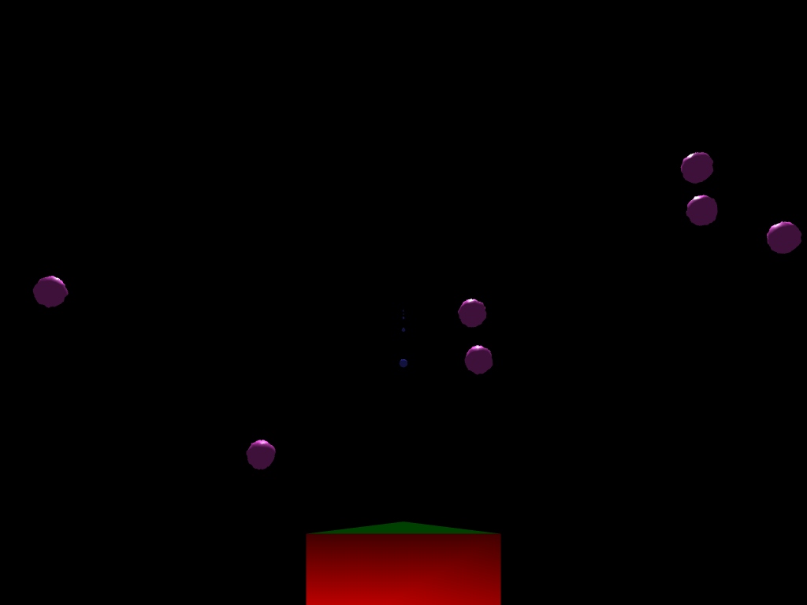

# Asteroids
Asteroids is a simple 3D version of the classic *Asteroids* arcade game. The
player controls a spaceship that flies in 3D space containing a large number of
asteroids, which he must avoid and destroy using the gun on his ship.

Asteroids is written in TypeScript, a statically typed, class-based,
compile-to-JavaScript language. Its only external dependencies are
[three.js](https://threejs.org/), a JavaScript 3D library,
[kd-tree-javascript](https://github.com/ubilabs/kd-tree-javascript), a
Javascript k-d tree implementation, [Pillow](https://python-pillow.org/), a
Python image manipulation library, and
[noise](https://pypi.python.org/pypi/noise/), a Python Perlin noise library.

## Running
When cloning, make sure that the `kd-tree-javascript` submodule is also cloned
by using the following command: `git clone --recursive
https://github.com/chrisf1337/asteroids.git`. If you already cloned the repo,
you can clone the submodule with `git submodule update --init --recursive`.

Next, build the bundle. Run `npm run build`.

Start a new server (e.g. in Python 3, `python3 -m http.server 8000 &>
/dev/null`) and go to `localhost:8000` on your browser.

## Browser compatibility
Tested on macOS 10.12.4 using Chrome 58.0.3029.96 (64-bit) and Firefox 53.0
(64-bit). Performance is better on Chrome.

## Controls
- `WA`: Pitch control (rotate spaceship up and down)
- `SD`: Yaw control (rotate spaceship left and right)
- `QE`: Roll control (rotate spaceship side to side)
- `F`: Hold to accelerate
- Left shift: Hold to decelerate
- Space: Fire
- `X`: Stop. The spaceship will immediately have a velocity of 0.
- `` ` ``: Enter debug mode. In debug mode, holding `F` and Left shift will move
  the spaceship forward and backward at constant velocity instead of applying
  acceleration/deceleration.

## Technical summary
The overall architecture of the application is simple. The `App` class in
`app.ts` contains the main game logic. The `Entity`, `Shot`, and `Asteroid`
classes in `entity.ts` are wrappers around three.js meshes that also keep track
of the object's position and velocity. The main game loop is in `App.draw()`. In
each iteration of the loop, we update the the position, velocity, and rotation
of the camera/spaceship, positions and velocities of the asteroids and shots,
create new shots if the user is firing, check for collisions between objects,
and remove objects from the scene if they are far away enough. We'll go over
some challenging features below.

### Collision detection
Asteroid objects are maintained in a k-d tree. In each loop, we check for
collisions between shots and asteroids, and the spaceship and asteroids, by
querying the k-d tree for the 10 nearest neighboring asteroids and checking if
any of the asteroids' bounding boxes intersect with the shot's or spaceship's
bounding box. If so, a collision has occurred, and the appropriate action is
taken. If the object is a shot, the asteroid is split into two smaller
asteroids. If the object is the spaceship, the game ends.

### Asteroid splitting
When an asteroid is struck by a shot, it is split into two smaller asteroids.
This is handled by the `Asteroid.split()` method, which returns two new Asteroid
objects. To handle conservation of mass, two random numbers are generated to
determine the ratio of volumes of the daughter asteroids, and their radii are
calculated from this ratio. To handle conservation of momentum, we choose two
random angles that the daughter asteroids should leave at, which allows us to
compute their velocities.

### Asteroid displacement maps
Asteroids are represented by three.js SphereGeometries with a displacement map.
To make them look more like asteroids and not perfect spheres, ten textures were
generated with a Python script
[`texturegen/texturegen.py`](texturegen/texturegen.py) using simplex noise to
create a 256 x 256 grayscale PNG that can be loaded by three.js's texture loader
to use as a displacement map. This results in bumpy looking spheres that look
slightly more asteroid-like.
